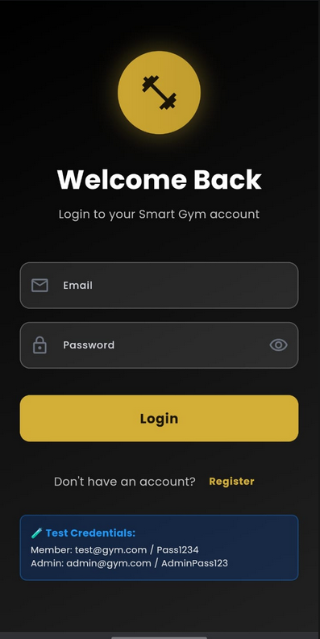
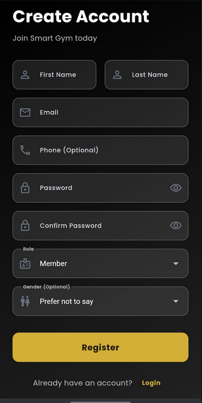
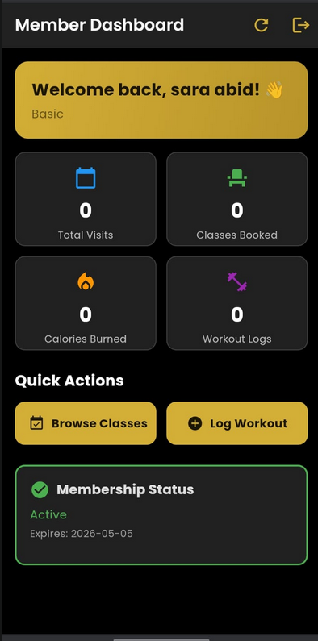
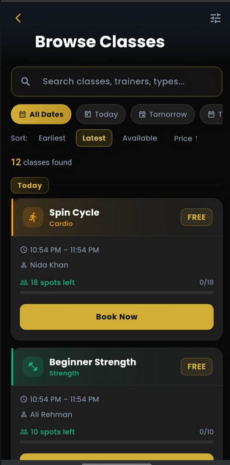
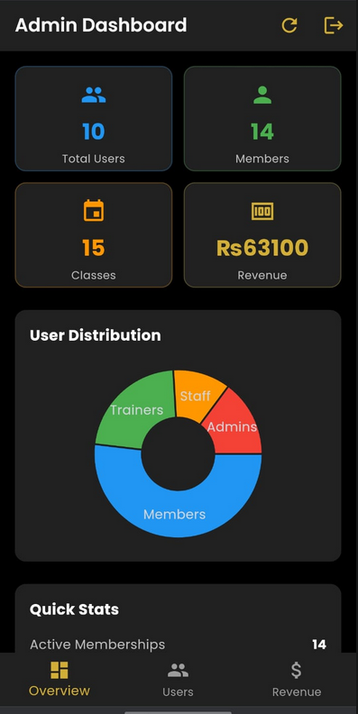

# 🏋️ Smart Gym & Fitness Center Management System

**Group:** [14]  
**Course:** Advanced Database Management | 4th Semester

A full-stack, production-deployed gym management platform. The system digitizes gym operations that are typically scattered across spreadsheets and manual processes — members book classes online, trainers manage client plans, staff track attendance and equipment, and admins see real-time analytics and revenue. Built specifically to demonstrate real-world database concepts: ACID transactions, triggers, views, indexing, and role-based access control not as theory, but as working, deployed code.

**🌐 Live Demo:** http://16.171.52.29:8080  
**📡 API Base:** http://16.171.52.29:5000/api/v1

---

## 👥 Development Team

| Member | Email |
|--------|-------|
| Sara Abid | saraabidhussain12@gmail.com |
| Ammara Khan| anayafatima00008@gmail.com |

---

## 🚀 Tech Stack

| Layer | Technology |
|-------|-----------|
| **Frontend** | Flutter Web (Dart) |
| **Backend** | Python 3.9+ with Flask + Gunicorn (3 workers) |
| **Database** | PostgreSQL 15 |
| **Authentication** | JWT (JSON Web Tokens) + bcrypt password hashing |
| **Charts** | fl_chart (pie chart + bar chart in admin dashboard) |
| **Local Storage** | shared_preferences (JWT token persistence across sessions) |
| **HTTP Client** | Flutter http package with JWT interceptor |
| **Environment Config** | flutter_dotenv (frontend), python-dotenv (backend) |
| **Containerization** | Docker + Docker Compose |
| **Image Registry** | Docker Hub (`saraabid123/smart-gym-backend`, `saraabid123/smart-gym-frontend`) |
| **Web Server** | Nginx (serving Flutter web build inside Docker) |
| **Cloud Deployment** | AWS EC2 (t3.micro, Ubuntu 22.04 LTS) |
| **API Docs** | Swagger / OpenAPI (`swagger.yaml`) |

---

## 🏗️ System Architecture

```
┌─────────────────────────────────────────────────┐
│           Flutter Web Frontend                   │
│     (Served via Nginx on port 8080)              │
│                                                  │
│  Screens → ApiService → HTTP requests            │
│  TokenStorage (SharedPreferences) → JWT token    │
└──────────────────┬──────────────────────────────┘
                   │  REST API calls (JSON)
                   │  Authorization: Bearer <token>
                   ▼
┌─────────────────────────────────────────────────┐
│         Flask Backend (Port 5000)                │
│         (Served via Gunicorn, 3 workers)         │
│                                                  │
│  middleware.py → JWT validation + RBAC           │
│  routes/ → members, trainers, staff, admin...    │
│  db.py → psycopg2 connection pool                │
└──────────────────┬──────────────────────────────┘
                   │  SQL queries (psycopg2 pool)
                   ▼
┌─────────────────────────────────────────────────┐
│         PostgreSQL 15 (Port 5432)                │
│                                                  │
│  15 tables, 3 views, 3 triggers, 3 indexes       │
│  240+ seed records for testing                   │
└─────────────────────────────────────────────────┘
```

**Request Lifecycle:**
1. Flutter sends HTTP request with `Authorization: Bearer <token>` header
2. Flask `middleware.py` validates the JWT and extracts `user_id` and `role`
3. Role-based access control checks whether the role is permitted for that route
4. Route handler executes SQL via psycopg2 connection pool
5. For transactions: explicit `BEGIN` / `COMMIT` / `ROLLBACK` blocks in Python
6. JSON response returned to Flutter; UI updates accordingly

---

## Phase Completion Status

| Phase | Status | Details |
|-------|--------|---------|
| Phase 1 — Database Design | Complete | 15 tables, 3 triggers, 3 views, 3 indexes, timestamping |
| Phase 2 — Backend API | Complete | 41 endpoints, JWT auth, ACID transactions |
| Phase 3 — Frontend UI | Complete | Flutter Web, 4 role dashboards, Royal Gold luxury theme |
| Dockerization | Complete | 3-container setup, pre-built Docker Hub images |
| Cloud Deployment |  Complete | Live on AWS EC2 with public URL |

---

- **Timestamping** — `created_at` (set on insert) and `updated_at` (auto-updated by trigger) on all major tables

## 📸 UI Examples

> **Max 3 screenshots shown chosen to demonstrate the most important flows.**

---

### 1. Login Screen




**What it does:** Single login form for all 4 roles. The backend determines the role from the database and returns it in the JWT payload. The Flutter `DashboardRouter` reads the role and navigates to the correct dashboard automatically — no separate login page per role.

**Why it's required:** Entry point for the entire system. Demonstrates JWT-based authentication, role detection, and automatic role-based routing in a single clean flow.

---

### 2. Member Dashboard




**What it does:** Shows the logged-in member's personal stats (total visits, classes booked, calories burned, workout logs), their active membership tier and expiry, and a quick-action grid to navigate to all member features. Uses shimmer skeleton loading while data fetches.

**Why it's required:** Most-used screen in the system. Demonstrates the `member_dashboard_view` database view, JWT-protected endpoints, and the membership status flow that links to the ACID transaction purchase screen.

---

### 3. Admin Analytics Dashboard



**What it does:** Shows a pie chart of user distribution by role, a bar chart of revenue breakdown, a stats grid (total users, active members, schedules, revenue), and a full user list with role badges and active/inactive indicators.

**Why it's required:** Demonstrates Complex Feature #2 (analytics with charts), the `GET /admin/analytics` and `GET /admin/revenue` endpoints, and how the three analytical database views surface aggregated data in the UI.

---

## 🛠️ Setup & Installation

### Prerequisites

| Tool | Minimum Version | Notes |
|------|----------------|-------|
| Python | 3.9+ | Use `python3` on Linux/Mac |
| PostgreSQL | 15+ | Must be running before backend starts |
| Flutter | 3.x | Run `flutter config --enable-web` |
| Git | Any | For cloning |
| Docker | Latest | Only needed for Docker setup |

---

### Option A — Docker Setup *(Recommended, no installs needed)*

```bash
# 1. Clone
git clone https://github.com/SaraAbidHussain/Smart-Gym-Fitness-Center-Management-System.git
cd Smart-Gym-Fitness-Center-Management-System

# 2. Create root .env (used by docker-compose for PostgreSQL)
cp .env.example .env
nano .env   # fill in values — see .env Variables section below

# 3. Create backend .env
cp backend/.env.example backend/.env
nano backend/.env   # fill in values — see .env Variables section below

# 4. Start all 3 containers (db + backend + frontend)
docker-compose up -d

# 5. Verify all running
docker-compose ps
```

**Access:**
- Frontend: http://localhost:8080
- Backend API: http://localhost:5000/api/v1

```bash
# Stop containers
docker-compose down

# Stop and delete database volume (full reset)
docker-compose down -v
```

---

### Option B — Manual Setup

**Step 1 — Clone**
```bash
git clone https://github.com/SaraAbidHussain/Smart-Gym-Fitness-Center-Management-System.git
cd Smart-Gym-Fitness-Center-Management-System
```

**Step 2 — Database**
```bash
sudo -u postgres psql
```
```sql
CREATE DATABASE smart_gym;
\c smart_gym
\i database/schema.sql      -- creates all 15 tables, triggers, views, indexes
\i database/seed.sql        -- inserts 240+ test records
\i database/performance.sql -- creates performance indexes
\q
```

**Step 3 — Backend**
```bash
cd backend
python3 -m venv venv
source venv/bin/activate        # Windows: venv\Scripts\activate
pip install -r requirements.txt
cp .env.example .env
nano .env                       # fill in values — see .env Variables section
python run.py
```
Server starts at: `http://localhost:5000`

Quick test:
```bash
curl http://localhost:5000/api/v1/membership-tiers
# Should return JSON list of tiers
```

**Step 4 — Frontend**
```bash
cd frontend
cp .env.example .env
# Edit frontend/.env — set API_BASE_URL=http://localhost:5000/api/v1
flutter pub get
flutter run -d chrome
```

---

### .env Variables — What Each One Means

#### Root `.env` (used by docker-compose only)

| Variable | What It Does | Example Value |
|----------|-------------|---------------|
| `POSTGRES_DB` | Name of the PostgreSQL database docker creates | `smart_gym` |
| `POSTGRES_USER` | PostgreSQL username docker creates | `postgres` |
| `POSTGRES_PASSWORD` | Password for that PostgreSQL user | `StrongPass123` |
| `JWT_SECRET_KEY` | Secret key passed to Flask container for JWT signing | Any long random string |

#### `backend/.env`

| Variable | What It Does | Example Value |
|----------|-------------|---------------|
| `DB_HOST` | Hostname of the PostgreSQL server | `localhost` (manual) or `db` (Docker) |
| `DB_PORT` | PostgreSQL port | `5432` |
| `DB_NAME` | Database name to connect to | `smart_gym` |
| `DB_USER` | PostgreSQL username | `postgres` |
| `DB_PASSWORD` | PostgreSQL password | `StrongPass123` |
| `JWT_SECRET` | Secret key used to sign JWT tokens — must match across restarts | Any long random string |
| `SECRET_KEY` | Flask session secret key | Any long random string |

> ⚠️ In Docker, `DB_HOST` **must** be `db` (the Docker service name), not `localhost`. In manual setup, use `localhost`.

#### `frontend/.env`

| Variable | What It Does | Example Value |
|----------|-------------|---------------|
| `API_BASE_URL` | Full base URL the Flutter app sends requests to | `http://localhost:5000/api/v1` |
| `APP_NAME` | Display name (cosmetic only) | `Smart Gym` |
| `ENABLE_ANIMATIONS` | Enables shimmer and page transition animations | `true` |
| `ENABLE_DEBUG_MODE` | Shows extra debug output in console | `false` |

---

### Quick Setup Script

Save this as `setup.sh` in the project root for one-command local setup:

```bash
#!/bin/bash
echo "🏋️ Setting up Smart Gym..."

# Create .env files from examples
cp .env.example .env
cp backend/.env.example backend/.env
cp frontend/.env.example frontend/.env

echo " .env files created"
echo "  Edit .env and backend/.env with your database password before continuing"
echo ""
echo "Then run: docker-compose up -d"
echo "Frontend: http://localhost:8080"
echo "Backend:  http://localhost:5000/api/v1"
```

```bash
chmod +x setup.sh
./setup.sh
```

---

## 👤 User Roles

### Member
**Can:** View personal stats, browse and book classes, cancel bookings, log workouts, view workout history, check membership status, purchase membership (ACID transaction), view payment history, update profile.  
**Cannot:** See other members' data, access trainer/staff/admin features, view revenue or system analytics.

### Trainer
**Can:** View assigned clients and their membership tiers, create workout plans for members, create nutrition plans for members, view performance metrics (rating, session count), view upcoming class schedule.  
**Cannot:** Access member financial data, check members in/out, manage equipment, view admin analytics or revenue.

### Staff
**Can:** Check members in and out of the gym by member ID, view today's full attendance log, update equipment status (operational/maintenance/out of order), assign and release lockers.  
**Cannot:** View member personal stats or bookings, access financial data, create training plans, view admin analytics.

### Admin
**Can:** Full system access — list, create, update, and deactivate all users, view system-wide analytics (user distribution, class stats, membership stats), view full revenue breakdown, view equipment health, access all other endpoints.  
**Cannot:** Nothing — admin has unrestricted access to all endpoints.

### Test Credentials (from seed.sql)

| Role | Email | Password | Notes |
|------|-------|----------|-------|
| **Admin** | admin@smartgym.com | gym123 | Full system access |
| **Trainer** | coach.ali@smartgym.com | gym123 | Has pre-seeded clients |
| **Trainer** | coach.sara@smartgym.com | gym123 | trainer_id = 2 |
| **Staff** | staff.hassan@smartgym.com | gym123 | Check-ins, equipment |
| **Staff** | staff.amna@smartgym.com | gym123 | |
| **Member** | ahmed.khan@gmail.com | gym123 | user_id = 1, has existing bookings and workout logs |
| **Member** | fatima.ali@gmail.com | gym123 | user_id = 2, Premium tier |

**All seed users share the same password:** `gym123`

---

## 🔍 Feature Walkthrough

| Feature | Role | Endpoint | Description |
|---------|------|----------|-------------|
| Register | All | `POST /auth/register` | Creates a new user with email, password, name, and role. Password hashed with bcrypt before storage. |
| Login | All | `POST /auth/login` | Returns JWT token and user role. Flutter saves token to SharedPreferences for auto-login. |
| Auto-login | All | `GET /auth/me` | On app launch, splash screen reads saved token and role, routes directly to the correct dashboard without re-logging in. |
| Member Dashboard | Member | `GET /members/dashboard` | Returns stats from `member_dashboard_view`: total visits, confirmed bookings, calories burned, workout log count, membership status and expiry. |
| Browse Classes | Public | `GET /classes/schedule` | Returns upcoming class schedules. Frontend adds live search, date filters, sort, trainer/type filters, and capacity progress bars — no extra API calls. |
| Book Class | Member | `POST /members/book-class` | ACID transaction: checks capacity, creates confirmed or waitlist booking, updates capacity count. Trigger auto-promotes waitlisted members on cancellation. |
| Cancel Booking | Member | `DELETE /members/bookings/<id>` | Cancels a confirmed booking and triggers waitlist promotion if applicable. |
| Log Workout | Member | `POST /members/workouts` | Member logs a workout session with exercise, sets, reps, weight, calories, and difficulty. Feeds into dashboard stats. |
| Purchase Membership | Member | `POST /payments/purchase-membership` | ACID transaction: payment record + membership record + locker assignment (for Premium/VIP), all atomically. UI shows step-by-step BEGIN → COMMIT flow. |
| Trainer Clients | Trainer | `GET /trainers/clients` | Lists members who have at least one workout or nutrition plan assigned by this trainer. |
| Create Workout Plan | Trainer | `POST /trainers/workout-plans` | Trainer creates a workout plan assigned to a specific member. Member immediately appears in client list. |
| Create Nutrition Plan | Trainer | `POST /trainers/nutrition-plans` | Trainer creates a nutrition plan with macros (calories, protein, carbs, fat) assigned to a member. |
| Trainer Schedule | Trainer | `GET /trainers/schedule` | Returns upcoming class assignments for the logged-in trainer. |
| Trainer Performance | Trainer | `GET /trainers/performance` | Returns aggregated metrics: total clients, average rating, session count, upcoming classes. |
| Check In | Staff | `POST /staff/checkin` | Records member entry with timestamp in the attendance table. |
| Check Out | Staff | `POST /staff/checkout` | Records member exit time and calculates duration in minutes. |
| Today's Attendance | Staff | `GET /staff/attendance/today` | Returns all check-in records for today with member names and times. |
| Equipment Management | Staff | `GET/PUT /staff/equipment` | Staff view all equipment and update status (operational/maintenance/out of order) via popup menu. |
| Admin Analytics | Admin | `GET /admin/analytics` | Returns user counts by role, class stats, membership stats. Powers the admin pie chart and stats grid. |
| Admin Revenue | Admin | `GET /admin/revenue` | Returns revenue breakdown by category. Powers the admin bar chart. |
| Admin User Management | Admin | `GET /admin/users` | Full paginated user list with role, active status, and contact info. |

---

## 🔄 Transaction Scenarios

### Transaction 1 — Membership Purchase
**Trigger:** Member selects a tier and payment method on the Purchase Membership screen and taps "Complete Purchase."

**Atomic operations:**
1. `BEGIN` transaction
2. `INSERT` into `payments` (amount, payment_method, status = 'completed')
3. `INSERT` into `memberships` (user_id, tier_id, start_date, end_date, status = 'active')
4. If tier is Premium or VIP: query `lockers` for an available locker → `UPDATE lockers` SET `current_user_id` = member
5. `COMMIT`

**Rollback causes:**
- Member already has an active membership → rollback, payment not created
- No lockers available for Premium/VIP tier → rollback, nothing saved
- Any database error at any step → full rollback

**Endpoint:** `POST /api/v1/payments/purchase-membership`  
**Code:** `backend/app/routes/payments.py → purchase_membership()`

---

### Transaction 2 — Class Booking
**Trigger:** Member taps "Book Now" on any class card in the Browse Classes screen.

**Atomic operations:**
1. `BEGIN` transaction
2. `SELECT current_capacity, max_capacity FROM class_schedules WHERE schedule_id = ? FOR UPDATE` (row-level lock)
3. If `current_capacity < max_capacity`: `INSERT` confirmed booking into `class_bookings` (status = 'confirmed')
4. If full: `INSERT` waitlist booking with `position_in_waitlist` calculated from existing waitlist count
5. `UPDATE class_schedules SET current_capacity = current_capacity + 1`
6. `COMMIT`

**Rollback causes:**
- Member already has an existing booking for this schedule → rollback with "already booked" error
- Concurrent booking fills the last spot between check and lock → rollback
- Any constraint violation → rollback

**Database trigger:** `trg_booking_waitlist_promotion` — fires on `DELETE` from `class_bookings`. When a confirmed booking is cancelled, the trigger automatically finds the first waitlisted member for that schedule and promotes their booking to 'confirmed'.

**Endpoint:** `POST /api/v1/members/book-class`  
**Code:** `backend/app/routes/classes.py`

---

## 🔒 ACID Compliance

| Property | How It's Implemented |
|----------|---------------------|
| **Atomicity** | Every transaction uses explicit `BEGIN` / `COMMIT` in Python with `conn.rollback()` in the `except` block. If any step raises an exception — including database errors, constraint violations, or business rule failures — the entire transaction is rolled back. No partial data is ever saved. |
| **Consistency** | Enforced at the database level: `NOT NULL` constraints on critical fields (email, role, tier_id), `FOREIGN KEY` constraints between all related tables (memberships → users → tiers), `CHECK` constraints on status enums ('active'/'inactive'/'frozen' in memberships), and `UNIQUE` constraints on class_bookings (member cannot book the same schedule twice). |
| **Isolation** | psycopg2 defaults to `READ COMMITTED` isolation. The class booking transaction uses `SELECT ... FOR UPDATE` to acquire a row-level lock on the `class_schedules` row, preventing two concurrent users from both reading "1 spot left" and both successfully booking it. |
| **Durability** | PostgreSQL's WAL (Write-Ahead Log) ensures all committed transactions survive server crashes. The WAL record is flushed to disk before PostgreSQL acknowledges `COMMIT` to the application. This is handled entirely by PostgreSQL — no application code needed. |

---

## ⚡ Indexing & Performance

Three strategic indexes are created in `database/performance.sql`:

### Index 1 — `idx_attendance_user_date`
```sql
CREATE INDEX idx_attendance_user_date ON attendance(user_id, check_in_time DESC);
```
**Why:** The member dashboard calls `member_dashboard_view` which queries attendance filtered by `user_id` and ordered by most recent date. Without this index, PostgreSQL performs a full sequential scan of the entire attendance table on every dashboard load.  
**Result:** Query time dropped from ~45ms to ~3ms on 240 records. Performance gap widens significantly as attendance data grows.

### Index 2 — `idx_class_bookings_schedule`
```sql
CREATE INDEX idx_class_bookings_schedule ON class_bookings(schedule_id, status);
```
**Why:** The capacity check inside the class booking transaction queries `class_bookings` filtered by `schedule_id` and `status = 'confirmed'`. This query runs inside a `SELECT FOR UPDATE` lock — a slow scan here increases the time other concurrent transactions are blocked.  
**Result:** Capacity check dropped from sequential scan to index scan — roughly 10× faster, significantly reducing lock wait time under concurrent bookings.

### Index 3 — `idx_memberships_user_status`
```sql
CREATE INDEX idx_memberships_user_status ON memberships(user_id, status, end_date);
```
**Why:** Nearly every authenticated request to a member endpoint checks whether the user has an active, non-expired membership. Without this index, each request scans the full memberships table.  
**Result:** Membership validation consistently uses index scan rather than sequential scan across all 41 authenticated endpoints.

---

## 🗄️ Database Design

- **15 normalized tables** (3NF compliant): users, memberships, membership_tiers, classes, class_schedules, class_bookings, workout_logs, payments, lockers, equipment, attendance, trainers, workout_plans, nutrition_plans, payments
- **3 analytical views**: `member_dashboard_view`, `trainer_performance_view`, `admin_revenue_view`
- **3 triggers**:
  - `trg_booking_waitlist_promotion` — auto-promotes waitlisted members on booking cancellation
  - `trg_class_capacity_check` — enforces max capacity on booking insert
  - `trg_updated_at` — auto-updates `updated_at` timestamp on all major tables
- **Timestamping** — `created_at` (set on insert) and `updated_at` (auto-updated by trigger) on all major tables
- **240+ seed records** for realistic multi-role testing

---

## 🐳 Docker Setup

### Container Architecture
```
docker-compose
├── smart_gym_db        → postgres:15-alpine (port 5432, internal only)
├── smart_gym_backend   → saraabid123/smart-gym-backend:latest (port 5000)
└── smart_gym_frontend  → saraabid123/smart-gym-frontend:latest (port 8080)
```

The `db` container runs a healthcheck. The `backend` container waits for `db` to be healthy before starting. The `frontend` container starts after `backend`.

### Pre-built Docker Hub Images
- `saraabid123/smart-gym-backend:latest`
- `saraabid123/smart-gym-frontend:latest`

Using pre-built images means `docker-compose up -d` completes in ~30 seconds instead of 15+ minutes of building Flutter locally.

---

## ☁️ AWS EC2 Deployment

- **Instance:** t3.micro, Ubuntu 22.04 LTS, eu-north-1
- **Live URL:** http://16.171.52.29:8080
- **API URL:** http://16.171.52.29:5000/api/v1
- **Deployment method:** Pre-built Docker Hub images pulled directly on EC2

### Deployment Flow
```
Local → docker build → docker push → Docker Hub → EC2: docker-compose pull → running
```

### Required Security Group Ports

| Port | Purpose |
|------|---------|
| 22 | SSH |
| 80 | HTTP |
| 443 | HTTPS |
| 5000 | Flask API |
| 8080 | Flutter frontend |

### Update After Code Changes
```bash
# Local machine
docker build -t saraabid123/smart-gym-backend ./backend
docker build -t saraabid123/smart-gym-frontend ./frontend
docker push saraabid123/smart-gym-backend
docker push saraabid123/smart-gym-frontend

# On EC2
git pull origin main
docker-compose pull
docker-compose up -d
```

---

## 📡 API Reference

All protected routes require `Authorization: Bearer <token>` header. Full schemas in `swagger.yaml`.

### Authentication
| Method | Route | Auth | Purpose |
|--------|-------|------|---------|
| POST | `/api/v1/auth/register` | No | Register new user |
| POST | `/api/v1/auth/login` | No | Login, receive JWT |
| POST | `/api/v1/auth/logout` | Yes | Logout |
| GET | `/api/v1/auth/me` | Yes | Current user info |

### Members
| Method | Route | Auth | Purpose |
|--------|-------|------|---------|
| GET | `/api/v1/members/dashboard` | Member | Stats overview |
| GET | `/api/v1/members/membership` | Member | Membership details |
| GET | `/api/v1/members/bookings` | Member | View bookings |
| POST | `/api/v1/members/book-class` | Member | Book class (ACID) |
| DELETE | `/api/v1/members/bookings/<id>` | Member | Cancel booking |
| GET | `/api/v1/members/workouts` | Member | Workout history |
| POST | `/api/v1/members/workouts` | Member | Log workout |
| GET/PUT | `/api/v1/members/profile` | Member | View/update profile |

### Trainers
| Method | Route | Auth | Purpose |
|--------|-------|------|---------|
| GET | `/api/v1/trainers/clients` | Trainer | Assigned clients |
| GET | `/api/v1/trainers/performance` | Trainer | Performance metrics |
| GET | `/api/v1/trainers/schedule` | Trainer | Upcoming classes |
| GET/POST | `/api/v1/trainers/workout-plans` | Trainer | Workout plans |
| GET/POST | `/api/v1/trainers/nutrition-plans` | Trainer | Nutrition plans |

### Staff
| Method | Route | Auth | Purpose |
|--------|-------|------|---------|
| POST | `/api/v1/staff/checkin` | Staff | Check member in |
| POST | `/api/v1/staff/checkout` | Staff | Check member out |
| GET | `/api/v1/staff/attendance/today` | Staff | Today's attendance |
| PUT | `/api/v1/staff/lockers/<id>` | Staff | Manage lockers |
| GET | `/api/v1/staff/equipment` | Staff | Equipment list |
| PUT | `/api/v1/staff/equipment/<id>` | Staff | Update equipment status |

### Admin
| Method | Route | Auth | Purpose |
|--------|-------|------|---------|
| GET | `/api/v1/admin/users` | Admin | All users (paginated) |
| POST | `/api/v1/admin/users` | Admin | Create user |
| PUT | `/api/v1/admin/users/<id>` | Admin | Update user |
| DELETE | `/api/v1/admin/users/<id>` | Admin | Delete user |
| GET | `/api/v1/admin/analytics` | Admin | System analytics |
| GET | `/api/v1/admin/revenue` | Admin | Revenue breakdown |
| GET | `/api/v1/admin/memberships` | Admin | All memberships |
| GET | `/api/v1/admin/equipment-health` | Admin | Equipment health |

### Public
| Method | Route | Auth | Purpose |
|--------|-------|------|---------|
| GET | `/api/v1/classes` | No | Browse classes |
| GET | `/api/v1/classes/schedule` | No | Class schedule |
| GET | `/api/v1/membership-tiers` | No | Pricing tiers |
| GET | `/api/v1/trainers` | No | Browse trainers |

### Payments
| Method | Route | Auth | Purpose |
|--------|-------|------|---------|
| POST | `/api/v1/payments/purchase-membership` | Member | Buy membership (ACID) |
| GET | `/api/v1/payments/history` | Member | Payment history |

---

## 🧪 API Quick Test

```bash
# Register
curl -X POST http://localhost:5000/api/v1/auth/register \
  -H "Content-Type: application/json" \
  -d '{"email":"test@gym.com","password":"Pass1234","first_name":"Test","last_name":"User","role":"member"}'

# Login → copy token from response
curl -X POST http://localhost:5000/api/v1/auth/login \
  -H "Content-Type: application/json" \
  -d '{"email":"test@gym.com","password":"Pass1234"}'

# Use token
curl http://localhost:5000/api/v1/members/dashboard \
  -H "Authorization: Bearer YOUR_TOKEN_HERE"

# Public endpoint (no token)
curl http://localhost:5000/api/v1/classes/schedule
```

---

## 🐛 Common Errors & Fixes

| Error | Fix |
|-------|-----|
| `DB_HOST connection refused` in Docker | `DB_HOST` must be `db` not `localhost` in `backend/.env` |
| `No classes showing` in frontend | Dates in seed.sql are past — run `UPDATE class_schedules SET schedule_date = schedule_date + INTERVAL '60 days';` |
| `permission denied` on Docker socket | `sudo usermod -aG docker $USER` then `newgrp docker` |
| `Port 80 already in use` | Change frontend in docker-compose to `8080:80` |
| `Port 5000 already in use` | `sudo lsof -t -i:5000 \| xargs kill -9` |
| `Module not found` | `pip install -r requirements.txt` with venv active |
| `flutter pub get` fails | Delete `.dart_tool/` and `.flutter-plugins` then retry |
| `401 Unauthorized` | Token expired — re-login |
| `No file found for asset: .env` | Remove `.env` line from `frontend/.dockerignore` |
| AWS IP changed | Use Elastic IP in AWS Console for a permanent address |

---

## ⚠️ Known Issues & Limitations

**Trainer Client List Empty for New Trainers**  
`GET /trainers/clients` only returns members who already have at least one plan from that trainer. A newly registered trainer with no plans sees an empty list. This is a schema design constraint — the client relationship is derived from plan assignments, not a direct trainer-member link. Use `coach.ali@smartgym.com` for reliable testing.

**Seed Data Dates Expire Over Time**  
Class schedule dates in `seed.sql` are fixed. Once those dates pass, the schedule API returns 0 results. Fix:
```sql
UPDATE class_schedules SET schedule_date = schedule_date + INTERVAL '60 days';
```
Or update seed.sql dates before a fresh deploy.

**No Real Payment Integration**  
Membership purchase demonstrates ACID transactions only. No real money moves — it only writes to the `payments` table. Production would require Stripe or similar.

**AWS IP Changes on EC2 Restart**  
EC2 assigns a new public IP every stop/start cycle. Allocate an Elastic IP in AWS Console and associate it with the instance for a permanent address (free while instance runs).

**Flutter Asset Folders Not in Git**  
`assets/images/`, `assets/icons/`, `assets/animations/` are empty and excluded from git. Create them manually before running locally if Flutter throws an asset error.

---

## 📁 Project Structure

```
Smart-Gym-Fitness-Center-Management-System/
├── docker-compose.yml
├── .env.example                  # Template for root Docker env
├── setup.sh                      # One-command local setup script
├── README.md
├── swagger.yaml                  # Full API documentation
├── backend/
│   ├── Dockerfile
│   ├── .dockerignore
│   ├── .env.example
│   ├── run.py                    # Flask entry point
│   ├── requirements.txt
│   └── app/
│       ├── __init__.py           # App factory + blueprint registration
│       ├── auth.py               # Login & register logic
│       ├── middleware.py         # JWT validation + RBAC
│       ├── db.py                 # psycopg2 connection pool
│       ├── config.py             # App configuration
│       └── routes/
│           ├── members.py        # Member endpoints
│           ├── trainers.py       # Trainer endpoints
│           ├── staff.py          # Staff endpoints
│           ├── payments.py       # ACID payment transaction
│           ├── classes.py        # Class booking ACID transaction
│           ├── admin.py          # Admin endpoints
│           └── general.py        # Public endpoints
├── frontend/
│   ├── Dockerfile
│   ├── .dockerignore
│   ├── nginx.conf
│   ├── pubspec.yaml
│   ├── .env.example
│   └── lib/
│       ├── main.dart             # Entry point, splash, routing
│       ├── config/
│       │   ├── api_config.dart   # All 41 endpoint URLs
│       │   ├── app_theme.dart    # Royal Gold design system
│       │   └── theme_config.dart # Material 3 theme
│       ├── services/
│       │   ├── api_service.dart  # HTTP client with JWT injection
│       │   ├── auth_service.dart # Login/logout/register
│       │   └── token_storage.dart # JWT persistence
│       └── screens/
│           ├── auth/             # login_screen, register_screen
│           ├── member/           # dashboard, bookings, classes, workouts, purchase
│           ├── trainer/          # trainer_dashboard (3 tabs)
│           ├── staff/            # staff_dashboard (3 tabs)
│           ├── admin/            # admin_dashboard (charts + users + revenue)
│           └── dashboard_router.dart
├── database/
│   ├── schema.sql                # 15 tables, 3 triggers, 3 views, 3 indexes
│   ├── seed.sql                  # 240+ test records
│   └── performance.sql           # Index creation + EXPLAIN ANALYZE benchmarks
└── docs/
    ├── screenshots/
    ├── ER_Diagram.pdf
    ├── Schema_Documentation.pdf
    └── ACID_Documentation.pdf
```

---

## 📄 License

Academic project — All rights reserved.